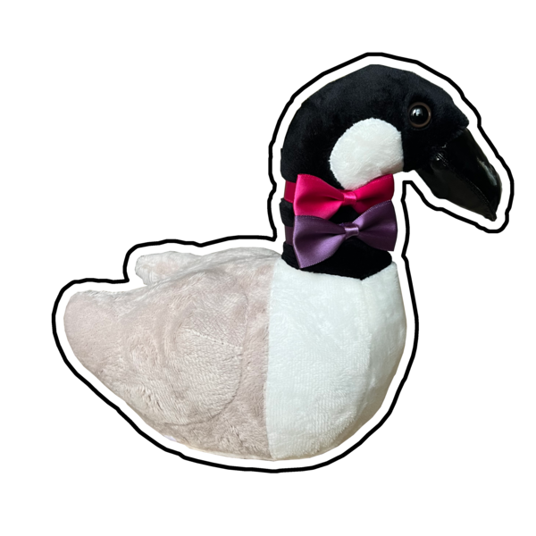

<p align="center">
  
  <h1 align="center">Typegeese</h1>
  <p align="center">
    Painless database migrations via <strong>migration-defined schemas</strong>
  </p>
</p>
<br/>

Typegeese is a type-safe ORM for MongoDB which introduces the concept of _migration-defined schemas_.

With Typegeese, your schema migrations become the source of truth for the structure of your data.

This makes it possible for Typegeese to automatically apply schema migrations on-demand without the need for migration generation scripts or complex data migration processes.

> **Note:** Typegeese is currently _experimental_; expect bugs, breaking changes, and incomplete documentation 😅

## Migration-defined schemas

Typegeese schemas are defined in terms of migrations, each of which creates a new versioned schema.

These migrations are defined using TypeScript classes powered by the amazing [typegoose](https://github.com/typegoose/typegoose) library (which is where the name _typegeese_ is inspired from).

The first version (v0) of a schema extends from `Schema('Name')`:

```typescript
// ./user/v0.ts
import { Schema, prop } from "typegeese";

export class User extends Schema('User')<User> {
  get _v() { return 'v0' as const };

  @prop({ type: () => String, required: true })
  email!: string;

  @prop({ type: () => String, required: false })
  name!: string | null;
}
```

```typescript
// ./user/$schema.ts
export * from './v0.js';
```

> The generic type argument after `Schema(...)` is used by typegeese's internal types to lookup the schema type from a mongoose model query. For example:
>
> ```typescript
> const user: User = await select(UserModel.findOne(...), { ... });
> //          ^ The generic type argument in the schema class
> //            definition allows typegeese infers the correct
> //            `User` schema type from this call
> ```
>
> Typegeese also uses this generic type argument to verify that the mandatory "_v" property is present on the class.

When you want to add a new property, you extend the previous version of your schema by passing it to typegeese's `Schema` function:

```typescript
// ./user/v1-add-profile-image.ts
import { Schema, prop } from "typegeese";

import * as UserV0 from './v0.js';

export class User extends Schema(UserV0)<User> {
  get _v() { return 'v1-profile-image' };

  @prop({ type: () => String, required: false })
  profileImageUrl!: string | null;
}
```

```typescript
// ./user/$schema.ts
export * from './v1-add-profile-image.js';
```

When the schema change requires a migration, you can export a `Model_migration` function from the file to apply those migrations:

```typescript
// ./user/v2-add-username.ts
import {
  createMigration,
  getModelForHyperschema,
  select,
  Schema,
  prop
} from 'typegeese';

import * as UserV1 from './v1-add-profile-image.js';

export class User extends Schema(UserV1)<User> {
  get _v() { return 'v2-add-username' };

  @prop({ type: () => String, required: true })
  username!: string;

  // This property is required by TypeScript to ensure that we don't forget to
  // add a migration (even if the migration is a no-op).
  __migration__: typeof User_migration
}

export const User_migration = createMigration<User>()
  .from(UserV1)
  .with(async function ({ _id }) {
    const UserV1Model = getModelForHyperschema(UserV1, { mongoose: this.mongoose });
    const user = await select(
      UserV1Model.findById(_id),
      { email: true }
    );
    return user;
  })
  .migrate({
    username() {
      return this.email.split("@")[0];
    }
  });
```

```typescript
// ./user/$schema.ts
export * from './v2-add-username.js';
```

For readability, typegeese exports a `t` helper that uses TypeScript that allows you to define a TypeScript type containing all of your schema's properties in one place:

```typescript
// ./user/$schema.ts
export * from './v2-add-username.js';

import type { t } from 'typegeese';
import type * as $ from '../$schemas.js';

// This type is type-checked by TypeScript to ensure that it always stays up to date with every new migration
type _User = t.Shape<
  $.User,
  {
    _id: string;
    name: string | null;
    email: string;
    profileImageUrl: string | null;
    username: string;
  }
>;
```

## Examples

The examples use the following UserV0 schema:

```typescript
// ./user/v0.ts
import { Schema, prop } from 'typegeese';

export class User extends Schema('User')<User> {
  get _v() { return 'v0' as const };

  @prop({ type: () => String, required: true })
  email!: string;

  @prop({ type: () => String, required: false })
  name!: string | null;
}
```

### Adding a new field

```typescript
// ./user/v1-add-username.ts
import {
  Schema,
  prop,
  createMigration,
  getModelForHyperschema,
  select
} from 'typegeese';

import * as UserV0 from './v0.js';

export class User extends Schema(UserV0)<User> {
  get _v() { return 'v1-add-username' };

  @prop({ type: () => String, required: true })
  username!: string;

  __migration__: typeof User_migration;
}

export const User_migration = createMigration<User>()
  .from(UserV0)
  .with(async function ({ _id }) {
    const UserV0Model = getModelForHyperschema(UserV0, { mongoose: this.mongoose });
    const user = await select(
      UserV0Model.findById(_id),
      { email: true }
    );
    return user;
  })
  .migrate({
    username() {
      return this.email.split("@")[0];
    }
  });
```

### Removing a field

```typescript
// ./user/v1-remove-name.ts
import { Schema, prop } from 'typegeese';

import * as UserV0 from './v0.js';

export class User extends Schema(
  UserV0
  { omit: { name: true } }
) {
  get _v() { return 'v1-remove-name' };

  __migration__: typeof User_migration
}

export const User_migration = createMigration<User>()
  .from(UserV0)
  .with(null)
  .migrate({});
```

### Renaming a field

```typescript
// ./user/v1-rename-name-to-full-name.ts
import {
  Schema,
  prop,
  createMigration,
  getModelForHyperschema,
  select
} from 'typegeese';

import * as UserV0 from './v0.js';

export class User extends Schema(
  UserV0,
  { omit: { name: true } }
)<User> {
  get _v() { return 'v1-rename-name-to-full-name' };

  @prop({ type: () => String, required: false })
  fullName!: string | null;

  __migration__: typeof User_migration;
}

export const User_migration = createMigration<User>()
  .from(UserV0)
  .with(async function ({ _id }) {
    const UserV0Model = getModelForHyperschema(UserV0, { mongoose: this.mongoose });
    const user = await select(
      UserV0Model.findById(_id),
      { name: true }
    );
    return user;
  })
  .migrate({
    fullName() {
      return this.name;
    }
  });
```

### Renaming a schema

In order to preserve compatibility with a blue/green deployment strategy, typegeese handles schema renames by running queries on both the old collection and the new renamed collection, and then lazily copying over documents into the new collection as they are queried from the renamed model.

```typescript
// ./_user/v1-rename-to-account.ts
// ^ We rename the folder to use an underscore prefix to indicate that it was renamed

import {
  Schema,
  prop,
  createMigration,
  getModelForHyperschema,
  select
} from 'typegeese';

export class User extends Schema(UserV0)<User> {
  get _v() { return 'v1-rename-to-account' };

  __migration__: typeof User_migration;
}

export const User_migration = createMigration<User>()
  .from(UserV0)
  .with(null)
  .migrate({});
```

```typescript
// ./account/v0.ts

import { User } from '../_user/$schema.js';

export class Account extends Schema('Account', { from: User })<Account> {
  get _v() { return 'v0' };
}
```

## Implementation

The `Schema(...)` function is used purely for type inference and returns the `Object` constructor at runtime:

```typescript
class User extends Schema('User')<User> {}
class Post extends Schema(PostV0)<Post> {
  get _v() { return 'v1' };
}

// Equivalent at runtime to:
class User extends Object {}
class Post extends Object {}
```

> In practice, `extends Object` is equivalent to omitting the `extends` clause.

By returning the `Object` constructor in the extends clause, we avoid using inheritance for migrations. This reduces the chance of conflicts with typegoose's intended uses of inheritance (e.g. for discriminator types).

Instead, typegeese dynamically constructs schemas at runtime when the functions `getModelForHyperschema` or `loadHyperschemas` are called.
